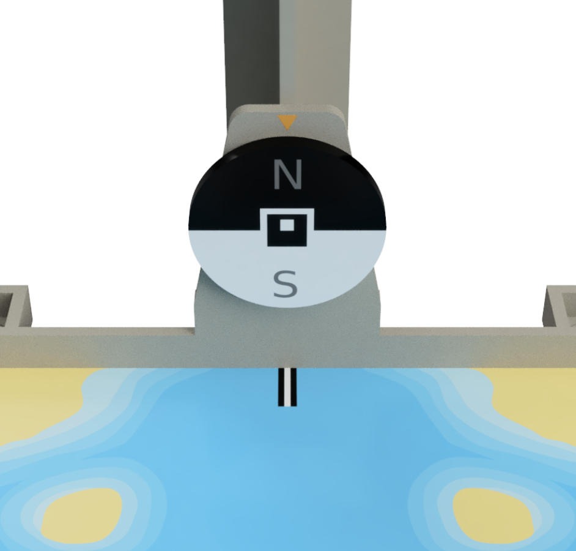

# Orientation detector

For the Coupe de Robotique, we need to determine the orientation of a compass.

## Description

Here is a description of the compass :

This program uses 2 different methods to determine the orientation :
- the first one uses the aruco tag in the middle
- the first one uses the black half-circle

Details can be found in the src folder.

## Setup 

TODO: setup

WARNING: PYTHON33333333